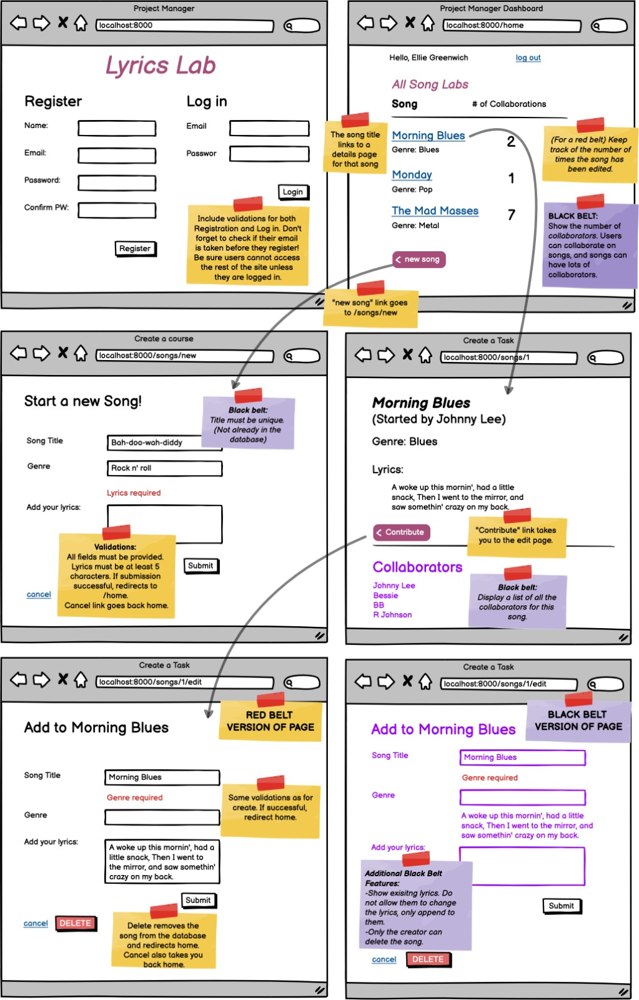
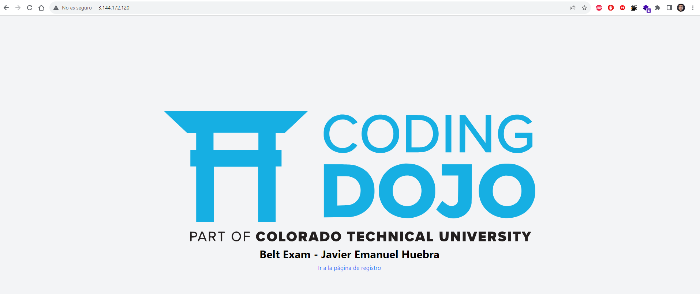
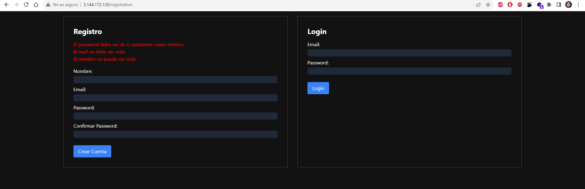
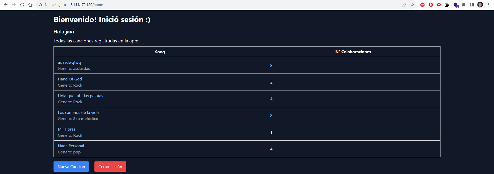
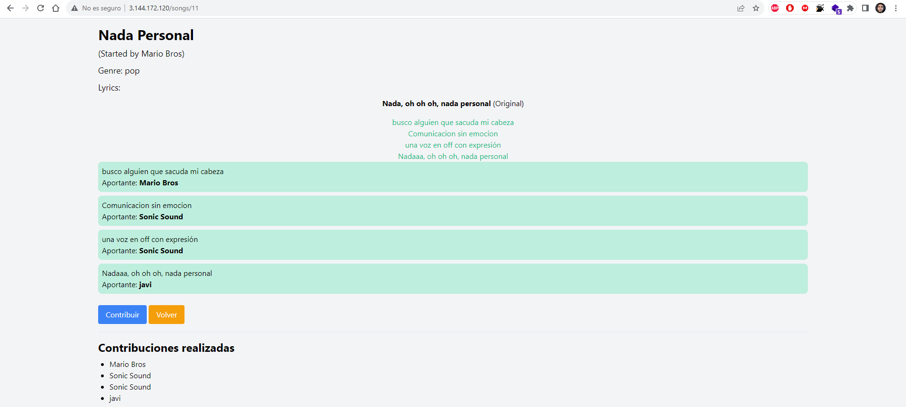
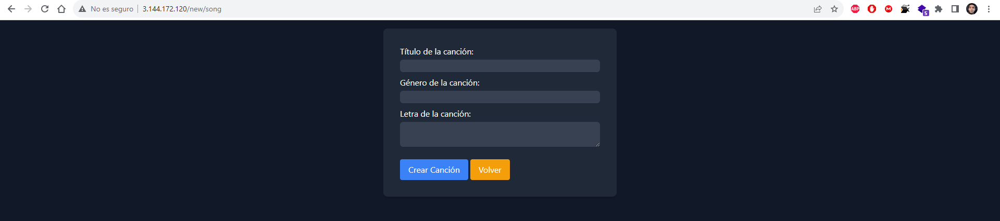
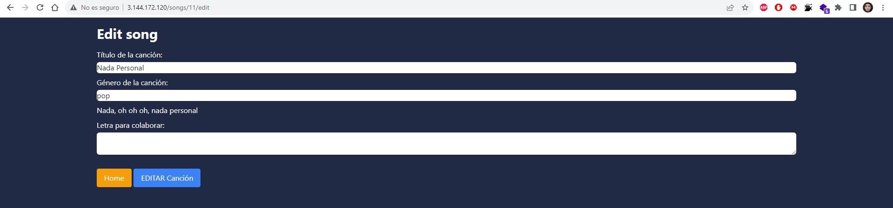
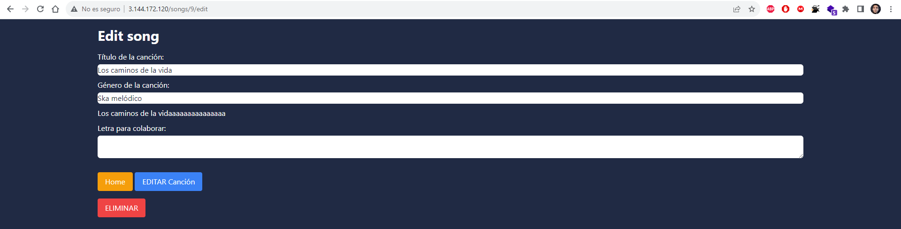

# Examen De Certificación Java Full Stack

### Examen de final de cursado del curso de Java Full Stack de Coding Dojo, en el cual se pide realizar un sistema de login y registro de usuarios, con posibilidad de crear canciones, que los usuarios puedan agregar sus ideas a esas canciones y asegurar la persistencia de la informacion, tanto del creador como de los usuarios que se unan con las correspondientes validaciones.

### Para completar el examen también se devia efectuar un deploy en una instancia de AWS, en este caso se utilizó una instancia EC2 con base de datos MySql en un servidor con sistema operativo Ubuntu 20.04 LTS.

### Consigna proporcionada por la institución (Proyecto a realizar):

 

### Instancia AWS EC2 en funcionamiento:

 

### Calificación Obtenida:

 

La condición para poder adquirir el cinturón negro (nota 10) era terminar el examen con el 100% de los requisitos en 5hs

### Imagenes del proyecto:

    
    
    
    
    
    
    

### Este proyecto fue realizado en la beca otorgada por Fundación Forge en conjunto con el instituto Coding Dojo

    <a href="https://fondationforge.org/">Link de Forge Foundation</a>
    ||
    <a href="https://fondationforge.org/">Link de Coding Dojo</a>

